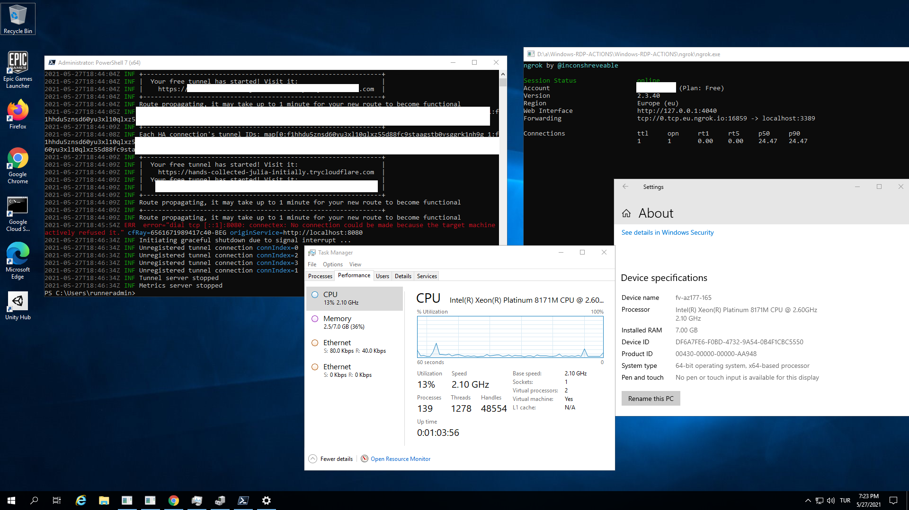

# Windows-RDP-ACTIONS

## Reverse RDP into Windows on GitHub Actions

Ever wonder what the Desktop of the Windows Runners on GitHub Actions looks like?

This functionality is like Appveyor's RDP functionality for their Windows workers:

https://www.appveyor.com/docs/how-to/rdp-to-build-worker/

### SECRET KEYS

You need set secrets on settings → (NGROK or CF)

* `CF_DOMAIN`  For Cloudflare Custom Domain mode
* `NGROK_AUTH_TOKEN`  Needed only for NGROK mode
* `NGROK_REGION`  Needed only for NGROK mode (options: `us`,`eu`,`ap`,`au`,`sa`,`jp`,`in`)
* `PASSWORD`  RDP password
* `TG_CHAT_ID`  Telegram user id for get login url
* `TG_TOKEN`  Telegram bot token for get message from bot

## Usage

These steps should be useful for debugging broken builds directly on the build worker. Use this project as reference and toss the steps into your project after some failing part of the build for introspection.

### Option 1 (Easiest way 🚑- No sound) 

1) Go https://shrinke.me/8IdNJ and login if needed.
2) Copy Powershell command that page.
3) Go actions tab in your forked repo.
4) Select `Chrome Remote Desktop`
5) Trigger action with your desired 6 digit pin and paste command in step 1.
6) Go again step 1 link in remote Support tab.
7) When setup finished , you can see the machine in list , write your pin and connect.
8) Enjoy! ☕
9) When you're done introspecting, cancel the job.

### Option 2 (Easy way 🚘) 

1) Get the tunnel auth token at: https://dashboard.ngrok.com/auth .
2) Under the repository's settings, make a secrets called `NGROK_AUTH_TOKEN`, `NGROK_REGION`,`TG_TOKEN`, `TG_CHAT_ID` and `PASSWORD`
3) Trigger a NGROK in actions page.
4) Wait until the last step which will hang forever as it connects to ngrok and sets up the reverse tunnel.
5) Wait from telegram bot to get url
6) Connect to the host and port combination with your RDP client of choice.
7) Use the username `runneradmin` and use the `PASSWORD` you set in secrets
8) Enjoy! ☕
9) When you're done introspecting, cancel the job.

---
### Option 3 (Harder but better performance ✈)

1) Download [cloudflared.exe](https://github.com/cloudflare/cloudflared/releases/latest/download/cloudflared-windows-amd64.exe)
2) Under the repository's settings, make a secrets called `TG_TOKEN`, `TG_CHAT_ID` and `PASSWORD`
3) Trigger a `cloudflared` in actions page. 
4) Wait from telegram bot to get url and copy
5) Open terminal/cmd and run this:
`cloudflared-windows-amd64.exe access rdp --hostname url.from.telegram.bot --url localhost:portfromlocal`
    > You can set any available port to `portfromlocal`
6) Then open rdp connect program and run just `localhost:portfromlocal`
7) Use the username `runneradmin` and use the `PASSWORD` you set in secrets
8) **TADAAAAA!!!** low delay more performance ✈

---
### Option 4 (Hardcore but best performance 🚀)

1) Download [cloudflared.exe](https://github.com/cloudflare/cloudflared/releases/latest/download/cloudflared-windows-amd64.exe)
2) Under the repository's settings, make a secrets called `CF_DOMAIN` ,`TG_TOKEN`, `TG_CHAT_ID` and `PASSWORD`
3) Trigger a `cloudflared_login` in actions page.
4) Wait from telegram bot to get url
5) Click link and login your Cloudflare account, Select your domain What you want to use 
6) Open terminal/cmd and run this:
`cloudflared-windows-amd64.exe access rdp --hostname SUBDOMAIN.YOUR.CF.DOMAIN.HERE --url localhost:portfromlocal`
    > You can set any available port to `portfromlocal`
7) Then open rdp connect program and run just `localhost:portfromlocal`
8) **TADAAAAA!!!** low delay more performance 🚀

## Useful Info

* Runners can run jobs for up to 6 hours. So you have about 6 hours minus the minute setup time to poke around in these runners.
* If using for introspection, add the [`continue-on-error`](https://help.github.com/en/actions/automating-your-workflow-with-github-actions/workflow-syntax-for-github-actions) property to the failing step before these remote connection steps.

## Future

Maybe as a GitHub Action? Oh well, this is fairly simple anyway. Or using something more FOSS than ngrok like https://github.com/TimeToogo/tunshell ?

## Similar Projects

These projects also allow remote introspection of very temporary environments like in GitHub Actions or other environments. 

* Shell-Only (macOS, Linux, and also Windows)
  * https://tunshell.com
* macOS VNC
  * https://github.com/dakotaKat/fastmac-VNCgui

---
This repo based on [Nelson Chen's reverse-rdp-windows-github-actions repo](https://github.com/nelsonjchen/reverse-rdp-windows-github-actions) and much more developed by [Kaan Dikeç](github.com/dikeckaan) and [Muhammed Galip Uludağ](https://github.com/mguludag/)

Thanks for [c9ffin](https://github.com/c9ffin/rdpwin) for chrome remote desktop idea
